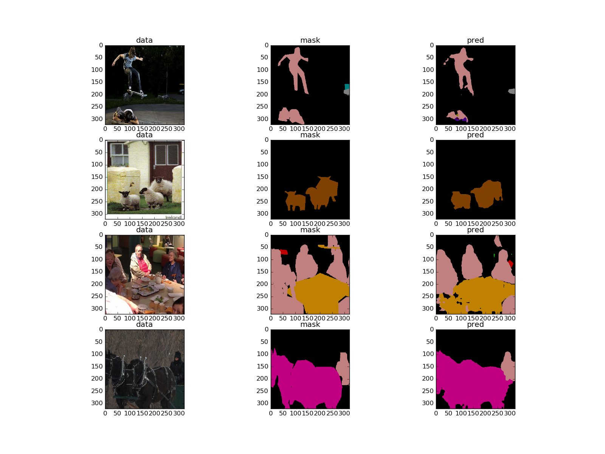

# DeepLab-ResNet-TensorFlow
This is an (re-)implementation of [DeepLab-ResNet](http://liangchiehchen.com/projects/DeepLabv2_resnet.html) in TensorFlow for semantic image segmentation on the [PASCAL VOC dataset](http://host.robots.ox.ac.uk/pascal/VOC/).

## Model Description

The DeepLab-ResNet is built on a fully convolutional variant of [ResNet-101](https://github.com/KaimingHe/deep-residual-networks) with [atrous (dilated) convolutions](https://github.com/fyu/dilation) to increase the field-of-view, atrous spatial pyramid pooling, and multi-scale inputs (not implemented here).

The model is trained on a mini-batch of images and corresponding ground truth masks with the softmax classifier on the top. During training, the masks are downsampled to match the size of the output from the network; during inference, to acquire the output of the same size as the input, bilinear upsampling is applied. The final segmentation mask is acquired using argmax over unnormalised log scores from the network.
Optionally, a fully-connected probabilistic graphical model, namely, CRF, can be applied to refine the final predictions.
On the test set of PASCAL VOC, the model shows <code>79.7%</code> of mean intersection-over-union.

For more details on the underlying model please refer to the following paper:


    @article{CP2016Deeplab,
      title={DeepLab: Semantic Image Segmentation with Deep Convolutional Nets, Atrous Convolution, and Fully Connected CRFs},
      author={Liang-Chieh Chen and George Papandreou and Iasonas Kokkinos and Kevin Murphy and Alan L Yuille},
      journal={arXiv:1606.00915},
      year={2016}
    }


## Requirements

TensorFlow needs to be installed before running the scripts.
TensorFlow>=0.11 is supported.

To install the required python packages (except TensorFlow), run
```bash
pip install -r requirements.txt
```
or for a local installation
```bash
pip install -user -r requirements.txt
```

## Caffe to TensorFlow conversion

To imitate the structure of the model, we have used `.caffemodel` files provided by the [authors](http://liangchiehchen.com/projects/DeepLabv2_resnet.html). The conversion has been performed using [Caffe to TensorFlow](https://github.com/ethereon/caffe-tensorflow) with an additional configuration for atrous convolution. 
There is no need to perform the conversion yourself as you can download the already converted model (`deeplab_resnet.ckpt`) [here](https://drive.google.com/open?id=0B_rootXHuswsTF90M1NWQmFYelU).

Nevertheless, it is easy to perform the conversion manually, given that the `.caffemodel` file has been downloaded, and [Caffe to TensorFlow](https://github.com/ethereon/caffe-tensorflow) dependencies have been installed. The Caffe model definition is provided in `misc/deploy.prototxt`. 
To extract weights from `.caffemodel`, run the following:
```bash
python convert.py /path/to/deploy/prototxt --caffemodel /path/to/caffemodel --data-output-path /where/to/save/numpy/weights
```
As a result of running the command above, the model weights will be stored in `/where/to/save/numpy/weights`. To convert them to `.ckpt`, simply execute:
```bash
python npy2ckpt.py /where/to/save/numpy/weights --save_dir=/where/to/save/ckpt/weights
```

## Dataset and Training

To train the network, one can use the augmented PASCAL VOC 2012 dataset with <code>10582</code> images for training and <code>1449</code> images for validation. 
To see the documentation on each of the training settings run the following:

```bash
python train.py --help
```
</img>

## Evaluation

The single-scale model shows <code>76.5%</code> mIoU on the Pascal VOC 2012 validation dataset. No post-processing step with CRF is being used.

To see the documentation on each of the evaluation settings run the following:
```bash
python evaluate.py --help
```

## Inference

To perform inference over your own images, use the following command:
```bash
python inference.py /path/to/your/image /path/to/ckpt/file
```
This will run the forward pass and save the resulted mask with this colour map:
</img>
</img>

## Missing features

At the moment, the post-processing step with CRF is not implemented. Besides that, multi-scale inputs are missing, as well.
