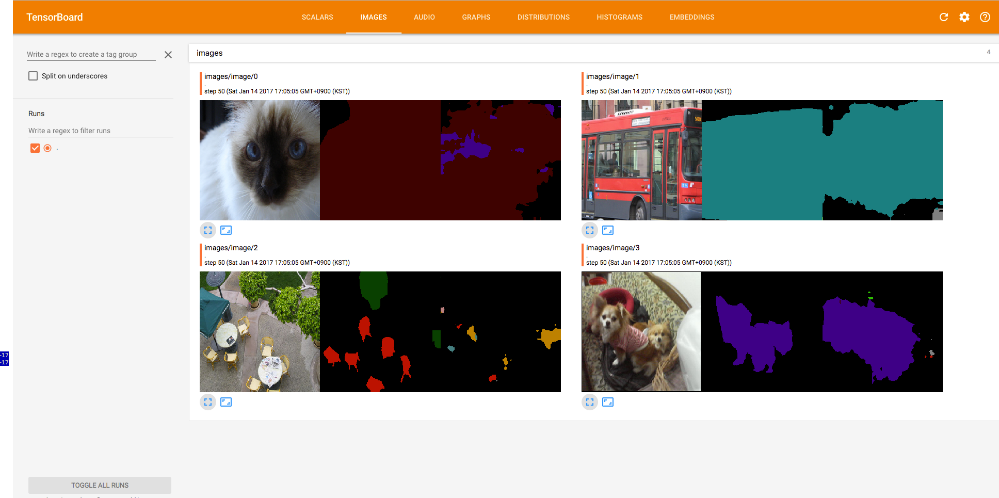
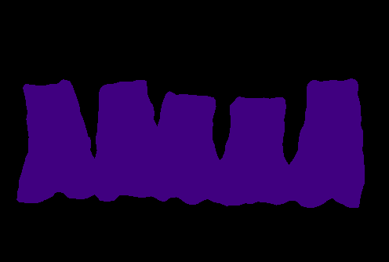

# DeepLab-ResNet-TensorFlow

[](https://travis-ci.org/DrSleep/tensorflow-deeplab-resnet)

This is an (re-)implementation of [DeepLab-ResNet](http://liangchiehchen.com/projects/DeepLabv2_resnet.html) in TensorFlow for semantic image segmentation on the [PASCAL VOC dataset](http://host.robots.ox.ac.uk/pascal/VOC/).

## Updates

**29 Jan, 2017**:
* Fixed the implementation of the batch normalisation layer: it now supports both the training and inference steps. If the flag `--is-training` is provided, the running means and variances will be updated; otherwise, they will be kept intact. The `.ckpt` files have been updated accordingly - to download please refer to the new link provided below.
* Image summaries during the training process can now be seen using TensorBoard.
* Fixed the evaluation procedure: the 'void' label (<code>255</code>) is now correctly ignored. As a result, the performance score on the validation set has increased to <code>80.1%</code>.

**11 Feb, 2017**:
* The training script `train.py` has been re-written following the original optimisation setup: SGD with momentum, weight decay, learning rate with polynomial decay, different learning rates for different layers, ignoring the 'void' label (<code>255</code>).
* The training script with multi-scale inputs `train_msc.py` has been added: the input is resized to <code>0.5</code> and <code>0.75</code> of the original resolution, and <code>4</code> losses are aggregated: loss on the original resolution, on the <code>0.75</code> resolution, on the <code>0.5</code> resolution, and loss on the all fused outputs.
* Evaluation of a single-scale converted pre-trained model on the PASCAL VOC validation dataset (using ['SegmentationClassAug'](https://www.dropbox.com/s/oeu149j8qtbs1x0/SegmentationClassAug.zip?dl=0)) leads to <code>86.9%</code> mIoU. This is confirmed by [the official PASCAL VOC server](http://host.robots.ox.ac.uk/anonymous/FIQPRH.html). The score on the test dataset is [<code>75.8%</code>](http://host.robots.ox.ac.uk/anonymous/EPBIGU.html).

**22 Feb, 2017**:
* The training script with multi-scale inputs `train_msc.py` now supports gradients accumulation: the relevant parameter `--grad-update-every` effectively mimics the behaviour of `iter_size` of Caffe. This allows to use batches of bigger sizes with less GPU memory being consumed. (Thanks to @arslan-chaudhry for this contribution!)
* The random mirror and random crop options have been added. (Again big thanks to @arslan-chaudhry !)

**23 Apr, 2017**:
* TensorFlow 1.1.0 is now supported.
* Three new flags `--num-classes`, `--ignore-label` and `--not-restore-last` are added to ease the usability of the scripts on new datasets. Check out [these instructions](https://github.com/DrSleep/tensorflow-deeplab-resnet#using-your-dataset) on how to set up the training process on your dataset.

## Model Description

The DeepLab-ResNet is built on a fully convolutional variant of [ResNet-101](https://github.com/KaimingHe/deep-residual-networks) with [atrous (dilated) convolutions](https://github.com/fyu/dilation), atrous spatial pyramid pooling, and multi-scale inputs (not implemented here).

The model is trained on a mini-batch of images and corresponding ground truth masks with the softmax classifier at the top. During training, the masks are downsampled to match the size of the output from the network; during inference, to acquire the output of the same size as the input, bilinear upsampling is applied. The final segmentation mask is computed using argmax over the logits.
Optionally, a fully-connected probabilistic graphical model, namely, CRF, can be applied to refine the final predictions.
On the test set of PASCAL VOC, the model achieves <code>79.7%</code> of mean intersection-over-union.

For more details on the underlying model please refer to the following paper:


    @article{CP2016Deeplab,
      title={DeepLab: Semantic Image Segmentation with Deep Convolutional Nets, Atrous Convolution, and Fully Connected CRFs},
      author={Liang-Chieh Chen and George Papandreou and Iasonas Kokkinos and Kevin Murphy and Alan L Yuille},
      journal={arXiv:1606.00915},
      year={2016}
    }


## Requirements

TensorFlow needs to be installed before running the scripts.
TensorFlow v1.1.0 is supported; for TensorFlow v0.12 please refer to this [branch](https://github.com/DrSleep/tensorflow-deeplab-resnet/tree/tf-0.12); for TensorFlow v0.11 please refer to this [branch](https://github.com/DrSleep/tensorflow-deeplab-resnet/tree/tf-0.11). Note that those branches may not have the same functional as the current master. 

To install the required python packages (except TensorFlow), run
```bash
pip install -r requirements.txt
```
or for a local installation
```bash
pip install -user -r requirements.txt
```

## Caffe to TensorFlow conversion

To imitate the structure of the model, we have used `.caffemodel` files provided by the [authors](http://liangchiehchen.com/projects/DeepLabv2_resnet.html). The conversion has been performed using [Caffe to TensorFlow](https://github.com/ethereon/caffe-tensorflow) with an additional configuration for atrous convolution and batch normalisation (since the batch normalisation provided by Caffe-tensorflow only supports inference). 
There is no need to perform the conversion yourself as you can download the already converted models - `deeplab_resnet.ckpt` (pre-trained) and `deeplab_resnet_init.ckpt` (the last layers are randomly initialised) - [here](https://drive.google.com/open?id=0B_rootXHuswsZ0E4Mjh1ZU5xZVU).

Nevertheless, it is easy to perform the conversion manually, given that the appropriate `.caffemodel` file has been downloaded, and [Caffe to TensorFlow](https://github.com/ethereon/caffe-tensorflow) dependencies have been installed. The Caffe model definition is provided in `misc/deploy.prototxt`. 
To extract weights from `.caffemodel`, run the following:
```bash
python convert.py /path/to/deploy/prototxt --caffemodel /path/to/caffemodel --data-output-path /where/to/save/numpy/weights
```
As a result of running the command above, the model weights will be stored in `/where/to/save/numpy/weights`. To convert them to the native TensorFlow format (`.ckpt`), simply execute:
```bash
python npy2ckpt.py /where/to/save/numpy/weights --save-dir=/where/to/save/ckpt/weights
```

## Dataset and Training

To train the network, one can use the augmented PASCAL VOC 2012 dataset with <code>10582</code> images for training and <code>1449</code> images for validation.

The training script allows to monitor the progress in the optimisation process using TensorBoard's image summary. Besides that, one can also exploit random scaling and mirroring of the inputs during training as a means for data augmentation. For example, to train the model from scratch with random scale and mirroring turned on, simply run:
```bash
python train.py --random-mirror --random-scale
```

</img>

To see the documentation on each of the training settings run the following:

```bash
python train.py --help
```

An additional script, `fine_tune.py`, demonstrates how to train only the last layers of the network. The script `train_msc.py` with multi-scale inputs fully resembles the training setup of the original model. 


## Evaluation

The single-scale model shows <code>86.9%</code> mIoU on the Pascal VOC 2012 validation dataset (['SegmentationClassAug'](https://www.dropbox.com/s/oeu149j8qtbs1x0/SegmentationClassAug.zip?dl=0)). No post-processing step with CRF is applied.

The following command provides the description of each of the evaluation settings:
```bash
python evaluate.py --help
```

## Inference

To perform inference over your own images, use the following command:
```bash
python inference.py /path/to/your/image /path/to/ckpt/file
```
This will run the forward pass and save the resulted mask with this colour map:
</img>
</img>

## Using your dataset

In order to apply the same scripts using your own dataset, you would need to follow the next steps:

0. Make sure that your segmentation masks are in the same format as the ones in the DeepLab setup (i.e., without a colour map). This means that if your segmentation masks are RGB images, you would need to convert each 3-D RGB vector into a 1-D label. For example, take a look [here](https://gist.github.com/DrSleep/4bce37254c5900545e6b65f6a0858b9c);
1. Create a file with instances of your dataset in the same format as in files [here](https://github.com/DrSleep/tensorflow-deeplab-resnet/tree/master/dataset);
2. Change the flags `data-dir` and `data-list` accordingly in thehttps://gist.github.com/DrSleep/4bce37254c5900545e6b65f6a0858b9c); script file that you will be using (e.g., `python train.py --data-dir /my/data/dir --data-list /my/data/list`);
3. Change the `IMG_MEAN` vector accordingly in the script file that you will be using;
4. For visualisation purposes, you will also need to change the colour map [here](https://github.com/DrSleep/tensorflow-deeplab-resnet/blob/master/deeplab_resnet/utils.py);
5. Change the flags `num-classes` and `ignore-label` accordingly in the script that you will be using (e.g., `python train.py --ignore-label 255 --num-classes 21`).
6. If restoring weights from the `PASCAL` models for your dataset with a different number of classes, you will also need to pass the `--not-restore-last` flag, which will prevent the last layers of size <code>21</code> from being restored.


## Missing features

The post-processing step with CRF is currently being implemented [here](https://github.com/DrSleep/tensorflow-deeplab-resnet/tree/crf).

    
## Other implementations
* [DeepLab-LargeFOV in TensorFlow](https://github.com/DrSleep/tensorflow-deeplab-lfov)
